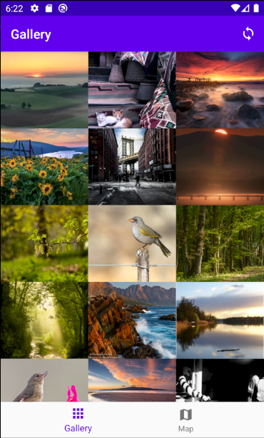
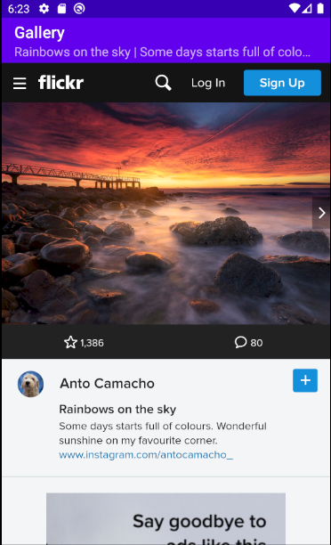
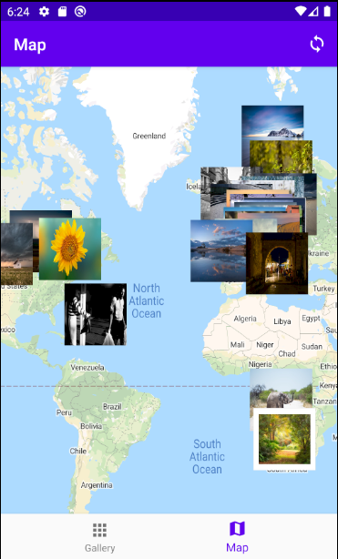

# Photo Gallery

> An android client application for Flickr that fetchs and displays interesting photos in a grid view and a map view.

This is a great project for learning Android App Development. It not only uses most of the useful features that all android app shares but implements with Kotlin, letting you practice the language at the same time.

## Included Android Features

1. **Activity** Hosts fragments, and enables communications between Activities with Intents
2. **Fragment** for UI flexibility
3. **ViewModel** for Persisting UI State
4. **Recycler View**
5. **Repository** as the single source of truth
6. **App Menu Bar**
7. Networking with **Retrofit**
8. Embedded **WebView**
9. Embeded **Google Map**

## Screenshots

